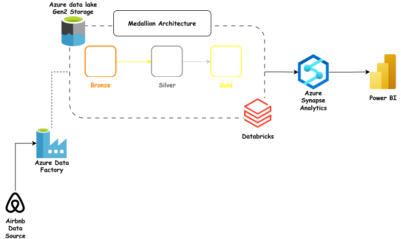
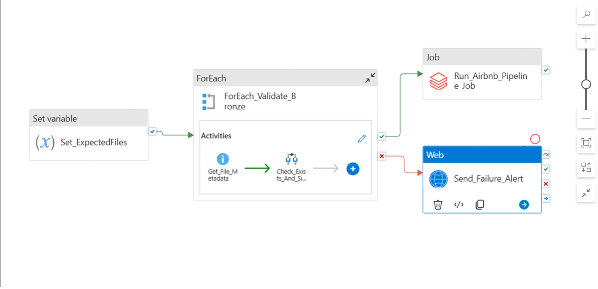
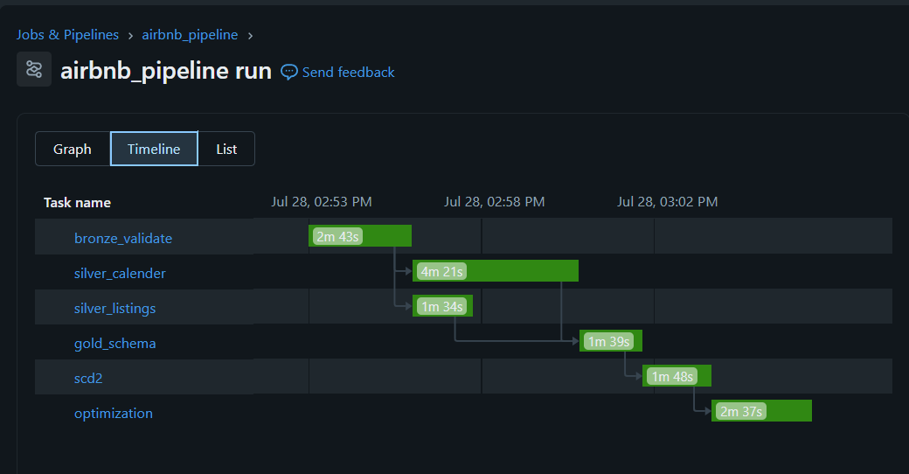
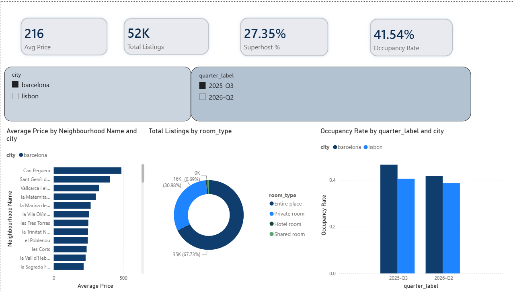

# Azure Data Engineering Portfolio Project

### Airbnb Analytics — ADF · Databricks · Delta Lake · Synapse · Power BI

A medallion architecture data platform on Azure: ingesting multi-city Airbnb listing and calendar data, transforming it through Bronze/Silver/Gold layers with Delta Lake (including SCD Type 2 host/listing history), serving curated data through Synapse Serverless SQL, and visualizing it in Power BI — orchestrated end-to-end by Azure Data Factory and Databricks Workflows.

## Architecture

**Flow:** raw Airbnb data is staged into ADLS Gen2 Bronze, then Azure Data Factory validates the expected files are present and triggers a **Databricks Workflow** — a six-task job with explicit dependencies (Silver listings and Silver calendar run in parallel, both feeding into Gold, then SCD2 history, then optimization). Gold Delta tables are exposed through Synapse Serverless SQL views, which Power BI connects to for the final dashboard.

## Data model

**Star schema**, built from two Silver sources (listings, calendar):

- `fact_listing_snapshot` — one row per listing per quarterly snapshot; the primary source for all price analysis
- `fact_calendar_availability` — one row per listing per day; availability and stay-length facts (31M+ rows)
- `dim_neighbourhood`, `dim_date` — static dimensions
- `dim_listing`, `dim_host` — **SCD Type 2** dimensions, tracking room type, neighbourhood, superhost status, and listing-count changes across snapshots

## Dataset

| Parameter  | Value                                                      |
| ---------- | ---------------------------------------------------------- |
| Source     | [Inside Airbnb](https://insideairbnb.com/get-the-data/)    |
| Cities     | Barcelona (Spain), Lisbon (Portugal)                       |
| Snapshots  | 2025-Q3, 2026-Q2 (two per city)                            |
| Files used | `listings.csv.gz`, `calendar.csv.gz`, `neighbourhoods.csv` |

## What this project demonstrates

**Azure Data Factory**

- Parameterized, folder-driven validation of source data before triggering downstream processing
- Orchestration of a Databricks Job (not just a single notebook) via the Databricks Job activity
- Failure-branch alerting via a Web Activity

**Azure Databricks / Apache Spark**

- Medallion architecture (Bronze → Silver → Gold) using PySpark and Delta Lake
- Schema validation and data-quality flagging at the Bronze layer
- Idempotent `MERGE`-based writes throughout Silver and Gold
- A six-task **Databricks Workflow** with explicit task dependencies and parallel execution
- **SCD Type 2** history built via an incremental MERGE pattern — processes each snapshot in chronological order, closing out changed dimension rows and inserting new current versions, fully idempotent on re-run
- `OPTIMIZE` with `ZORDER BY` and `VACUUM` on the largest Gold tables

**Azure Synapse Analytics (Serverless SQL)**

- External views over Gold Delta tables via `OPENROWSET`
- A layered view structure: base views per Gold table, business-question views built on top

**Power BI**

- Two-page dashboard: market overview (price, occupancy, room type mix by city/neighbourhood) and host history (superhost status changes, powered directly by the SCD2 dimension)

## Key analytics delivered

- Average price and room-type mix by neighbourhood, per city
- Occupancy rate by city and quarter
- Top neighbourhoods by listing concentration
- Cross-city comparison (Barcelona vs. Lisbon)
- **Hosts who gained or lost superhost status** between snapshots — powered by the SCD2 history table, not a point-in-time snapshot
